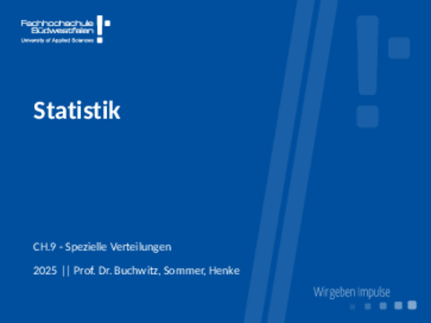
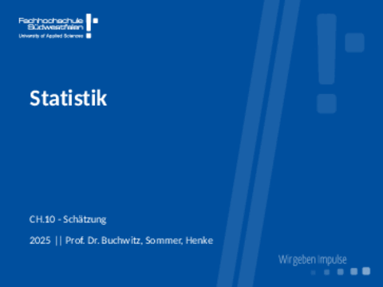

--- 
title: "Statistics"
author: "Benjamin Buchwitz"
date: "`r Sys.Date()`"
site: bookdown::bookdown_site
output: bookdown::gitbook
documentclass: book
bibliography: [book.bib, packages.bib]
biblio-style: apalike
link-citations: yes
github-repo: bchwtz/bchwtz-stat
description: "Statistics Course Notes"
---

# Einführung {-}

Placeholder


<!--chapter:end:index.Rmd-->

# Grundlegende Begriffe 
 
```{r, echo = F, out.width="80%", fig.cap="[Download Slides](slides/01-Begriffe.pdf)"}
knitr::include_graphics("slides/gifs/01-Begriffe.gif")
```


<!--chapter:end:01-Begriffe.Rmd-->

# Begriff der Häufigkeit 
 
```{r, echo = F, out.width="80%", fig.cap="[Download Slides](slides/02-Haeufigkeit.pdf)"}

```


<!--chapter:end:02-Haeufigkeit.Rmd-->

# Maßzahlen
 
```{r, echo = F, out.width="80%", fig.cap="[Download Slides](slides/03-Masszahlen.pdf)"}
knitr::include_graphics("slides/gifs/03-Masszahlen.gif")
```

<!--chapter:end:03-Masszahlen.Rmd-->

# Zweidimensionale Verteilungen
 
```{r, echo = F, out.width="80%", fig.cap="[Download Slides](slides/04-Zusammenhang.pdf)"}
knitr::include_graphics("slides/gifs/04-Zusammenhang.gif")
```

<!--chapter:end:04-Zusammenhang.Rmd-->

# Kombinatorik

```{r, echo = F, out.width="80%", fig.cap="[Download Slides](slides/05-Kombinatorik.pdf)"}

```

 

<!--chapter:end:05-Kombinatorik.Rmd-->

# Wahrscheinlichkeitsrechnung

```{r, echo = F, out.width="80%", fig.cap="[Download Slides](slides/06-Wahrscheinlichkeitsrechnung.pdf)"}

```

 

<!--chapter:end:06-Wahrscheinlichkeitsrechnung.Rmd-->

# Anwendungen der Wahrscheinlichkeitsrechnung
 
```{r, echo = F, out.width="80%", fig.cap="[Download Slides](slides/07-WskAnwendung.pdf)"}
knitr::include_graphics("slides/gifs/07-WskAnwendung.gif")
```

<!--chapter:end:07-WskAnwendung.Rmd-->

# Wahrscheinlichkeitsverteilungen
 
```{r, echo = F, out.width="80%", fig.cap="[Download Slides](slides/08-WskVerteilungen.pdf)"}
knitr::include_graphics("slides/gifs/08-WskVerteilungen.gif")
```

<!--chapter:end:08-WskVerteilungen.Rmd-->

# Spezielle Verteilungen
 
```{r, echo = F, out.width="80%", fig.cap="[Download Slides](slides/09-Verteilungen.pdf)"}

```

<!--chapter:end:09-Verteilungen.Rmd-->

# Von der Stichprobe zur Grundgesamtheit
 
```{r, echo = F, out.width="80%", fig.cap="[Download Slides](slides/10-Schaetzung.pdf)"}

```

<!--chapter:end:10-Schaetzung.Rmd-->

# Hypothesentests
 
```{r, echo = F, out.width="80%", fig.cap="[Download Slides](slides/11-Hypothesentests.pdf)"}
knitr::include_graphics("slides/gifs/11-Hypothesentests.gif")
```

<!--chapter:end:11-Hypothesentests.Rmd-->

# Lineare Regression
 
```{r, echo = F, out.width="80%", fig.cap="[Download Slides](slides/12-Regression.pdf)"}

```

<!--chapter:end:12-Regression.Rmd-->

# Multiple Regression
 
 
```{r, echo = F, out.width="80%", fig.cap="[Download Slides](slides/13-MultipleRegression.pdf)"}

```

<!--chapter:end:13-MultipleRegression.Rmd-->

# Zeitreihenanalyse


<!--chapter:end:14-Zeitreihenanalyse.Rmd-->


# Daten

Placeholder


## Taxi Trips
### Vorbereitungen
### Datenbeschreibung
### Daten laden
### Tips & Tricks
### Quellen
## Hauspreise
### Vorbereitungen
### Datenbeschreibung
### Daten laden
### Quellen
## Human Ressources
### Vorbereitungen
### Datenbeschreibung
### Daten laden
### Tips & Tricks
### Quellen

<!--chapter:end:15-Daten.Rmd-->

---
title: "Checkliste"
author: "Hannah Behrens"
date: "Stand: 25.01.2022"

toc: true
tocoverview: false
tocheader: Inhaltsübersicht
titlefontsize: 22pt


output: pdf_document
---


<!--chapter:end:Checklist.Rmd-->

---
title: "Checkliste"
author: "Hannah Behrens"
date: "Stand: 25.01.2022"
output: pdf_document
---

```{r setup, include=FALSE}
knitr::opts_chunk$set(echo = TRUE)
```

## R Markdown

This is an R Markdown document. Markdown is a simple formatting syntax for authoring HTML, PDF, and MS Word documents. For more details on using R Markdown see <http://rmarkdown.rstudio.com>.

When you click the **Knit** button a document will be generated that includes both content as well as the output of any embedded R code chunks within the document. You can embed an R code chunk like this:

```{r cars}
summary(cars)
```

## Including Plots

You can also embed plots, for example:

```{r pressure, echo=FALSE}
plot(pressure)
```

Note that the `echo = FALSE` parameter was added to the code chunk to prevent printing of the R code that generated the plot.

<!--chapter:end:Checkliste.Rmd-->

# (PART\*) Appendix {-} 

# Scientific Writing in R Markdown {-}

<!--chapter:end:Scientific_Writing_in_R_Markdown.Rmd-->

# Evaluation {-}

```{r, eval=F}
stats_ss2021 <- tribble(
  ~date, ~vg, ~g, ~n, ~b, ~vb, ~total,
  "07.04.2021",45,71,7,0,0,128,
  "12.04.2021",24,63,10,0,0,119,
  "14.04.2021",34,55,20,0,0,118,
  "19.04.2021",15,54,12,2,0,97,
  "26.04.2021",17,42,8,2,1,99,
  "28.04.2021",55,38,13,1,0,115,
  "05.05.2021",23,37,13,1,0,110
)
evcnames<- c("Datum","sehr zufrieden", "zufrieden", 
           "weder zufrieden noch unzufrieden", 
           "unzufrieden", "sehr unzufrieden", "anwesend")
kable(stats_ss2021, booktabbs=T, col.names = evcnames)
```


# System Info {-}
```{r}
Sys.time()
sessionInfo()
```


<!--chapter:end:XX-Appendix.Rmd-->

