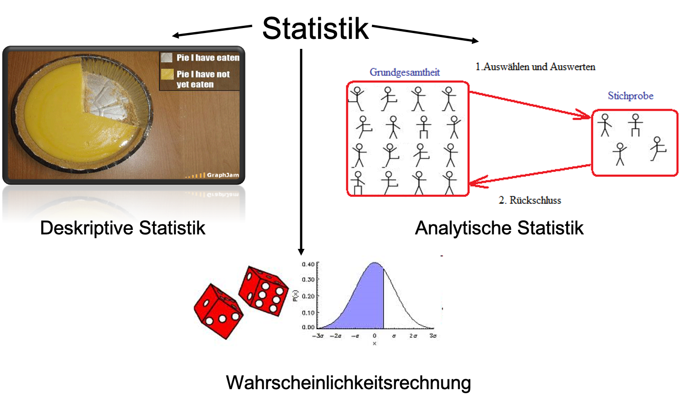

```{r setup, include=FALSE}
library(knitr)
library(HistogramTools)
knitr::opts_chunk$set(echo = TRUE, cache=TRUE, size="scriptsize", 
                      fig.align = "center")
def.chunk.hook  <- knitr::knit_hooks$get("chunk")
knitr::knit_hooks$set(chunk = function(x, options) {
  x <- def.chunk.hook(x, options)
  ifelse(options$size != "normalsize", paste0("\n \\", options$size,"\n\n", x, "\n\n \\normalsize"), x)
})

```

## Was ist Statistik?

```{r, echo=F, out.height="80%"}

```

## Inhalte der Vorlesung

\Large
1. Deskriptive Statistik
2. Wahrscheinlichkeitsrechnung
3. Induktive/Analytische Statistik

## Inhalte der Vorlesung

```{r, echo=F, out.height="80%"}

```

## Teil 1: Deskriptive Statistik

- Häufigkeiten 
- Graphische Darstellungen 
- Tabellen
- Lagemaße
- Streuungsmaße
- Konzentrationsmaße
- Korrelationskoeffizient

## Beispiele: Deskriptive Statistik

- Angenommen Sie besitzen ein Wertpapier (z.B. Bitcoin), das in den letzten Jahren die folgenden Wertveränderungen durchlaufen hat. Ermitteln Sie die durchschnittliche Wertsteigerung dieses Wertpapiers.

```{r, echo=F}
year <- as.numeric(format(Sys.time(), format = "%Y"))
ret <- c(.12, .07, .01, .04, -.1)
d <- data.frame(
  Jahr = (year-5):(year - 1),
  Veränderung = paste(ret * 100,"%"))
kable(d, booktabs=T, align = "c")
```

## Beispiel: Deskriptive Statistik

- Bei einer Befragung von 1195 über 14jährigen Deutschen durch das Institut **promit** im Februar 2011 tippten 51,5 % auf Borussia Dortmund, 15,8 % auf Bayern München, 3,7 % auf FC Schalke 04, 1,5 % auf den Hamburger SV und 1,0 % auf Bayer 04 Leverkusen als Deutschen Fußballmeister 2011. 21,6 % machten keine Angaben, der Rest glaubte an einen anderen Verein als Meister. Stellen Sie die Daten graphisch dar.

```{r, echo=F, fig.height=3}
p <- c(.515, .158, .037, .015, .010, .216)
p <- c(p, 1 - sum(p))
team <- c("Borussia Dortmund", "Bayern München", "FC Schalke", "Hamburger SV", 
          "Bayer Leverkusen", "keine Angabe", "Anderer Verein")
names(p) <- team
d <- data.frame(Team = team, Anteil = p)
barplot(p, main = "Wer wird Deutscher Fußballmeister 2011",
        ylab = "Anteil", cex.names = 0.6, cex.axis = 0.7, ylim=c(0, .6))
```

## Teil 2: Wahrscheinlichkeitsrechnung

- Kombinatorik
- Zufallsexperimente
- Wahrscheinlichkeiten
- Bedingte Wahrscheinlichkeiten
- Zufallsvariablen
- Verteilungsfunktionen
- Spezielle Verteilungen (z.B. Normalverteilung)

## Beispiel: Wahrscheinlichkeitsrechnung

- Ein Unternehmen erhält wiederholt Lieferungen von 800 Flaschen zur Verpackung von flüssigem Waschmittel. Mit dem Lieferanten ist vereinbart, dass Lieferungen mit mehr als 2% fehlerhaften Flaschen zurückgewiesen werden dürfen. Aus Zeit- und Kostengründen kann das Unternehmen nicht alle gelieferten Flaschen prüfen. Um zu entscheiden, ob es die Lieferungen zurückweist, verfährt es daher nach folgender Regel:
  + Der Lieferung werden 50 Flaschen zufällig entnommen und geprüft. Die Lieferung wird zurückgewiesen, wenn mehr als eine Flasche nicht dem vereinbarten Qualitätsstandard entspricht.
Wie groß ist die Wahrscheinlichkeit, dass eine gerade noch zulässige Lieferung, d.h. genau 2% fehlerhafte Flaschen, zurückgewiesen wird.

## Teil 3: Induktive/Analytische Statistik

- Stichproben
- Konfidenzintervalle 
- Testen von Hypothesen 
- Lineare Regression 
- Multiple Regression
- Zeitreihenanalyse

## Beispiel: Induktive/Analytische Statistik

- Für ein Konzert in Meschede wurden die Karten im Radio verlost. Sie befragen alle 400 Besucher des Konzertes nach ihrem Schokoladenkonsum zu Weihnachten (Dezember `r as.numeric(format(Sys.time(), format = "%Y")) - 1`). Dabei ermitteln Sie einen durchschnittlichen Schokoladenkonsum von 455 g bei einer Standardabweichung von 130 g.
Mit diesen Daten möchten Sie auf den Schokoladenkonsum der Bevölkerung im Hochsauerlandkreis schließen. Geben Sie an in welchem Bereich der durchschnittlich Schokoladenkonsum eines HSK-Bürgers mit 90%iger Sicherheit lag.
